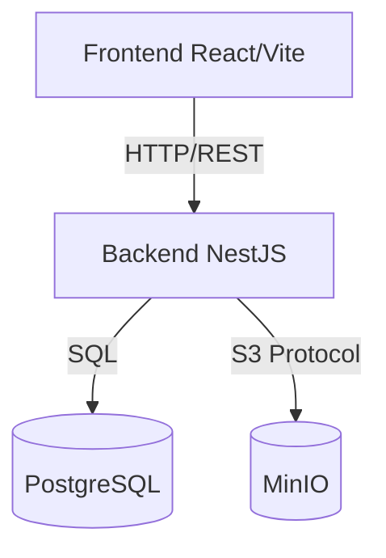

# Documentation Technique Globale du Projet "Shader Community"

Ce document `READMEia.md` offre une vue d'ensemble complète de l'architecture technique, des choix technologiques et des fonctionnalités du projet "Shader Community". Ce projet est une plateforme permettant aux développeurs graphiques de partager, explorer et commenter des shaders.

---

## 🏗 Architecture Globale

Le projet repose sur une architecture moderne séparant le frontend, le backend, la base de données et le service de stockage de fichiers, le tout orchestré par Docker.



### 📦 Conteneurisation (Docker)
L'ensemble de l'infrastructure est défini dans le fichier `docker-compose.yml` à la racine, orchestrant 4 services :
1.  **Backend (`shader-backend`)** : L'API NestJS (Port 3000).
2.  **Frontend (`shader-frontend`)** : L'interface React (Port 5173).
3.  **Base de données (`shader-db`)** : PostgreSQL 17 (Port 5433).
4.  **Stockage (`shader-minio`)** : Serveur de stockage d'objets compatible S3 (Port 9000/9001).

---

## 🖥 Frontend (`shader-frontend`)

Le frontend est une Single Page Application (SPA) construite pour offrir une expérience utilisateur fluide et réactive.

*   **Technologies :**
    *   **React 19** : Bibliothèque d'interface utilisateur.
    *   **TypeScript** : Pour la sécurité du typage.
    *   **Vite** : Outil de build ultra-rapide.
    *   **GSAP (GreenSock)** : Pour les animations avancées (intro, transitions de formulaire).
    *   **Axios** : Client HTTP pour communiquer avec l'API.

*   **Fonctionnalités Clés :**
    *   **Authentification :** Un formulaire unifié (Login/Register) avec gestion des tokens JWT stockés en `localStorage`.
    *   **Intercepteurs Axios :** Injection automatique du token JWT (`Authorization: Bearer ...`) dans chaque requête sortante.
    *   **Design :** Interface sombre "Dark Mode" orientée développeur.

---

## ⚙️ Backend (`nestjs-shader-community-backend`)

Le backend est une API REST robuste construite avec NestJS, suivant une architecture modulaire stricte.

### Technologies Clés
*   **Framework :** [NestJS](https://nestjs.com/) (Node.js)
*   **Langage :** TypeScript
*   **Base de Données :** PostgreSQL
*   **ORM :** TypeORM (Gestion des entités et relations SQL)
*   **Authentification :** Passport, JWT, Bcrypt
*   **Stockage :** AWS SDK v3 (Compatible MinIO/S3)
*   **Validation :** `class-validator` (Validation stricte des DTOs en entrée)

### 📂 Architecture des Modules

L'API est découpée en modules fonctionnels indépendants :

#### 1. Module Auth (`src/modules/auth`)
Gère la sécurité et l'émission des tokens.
*   **Endpoints :**
    *   `POST /auth/login` : Vérifie les identifiants et retourne un `access_token`.
*   **Sécurité :** Utilise `bcrypt` pour comparer les hashs et `Passport-JWT` pour signer les tokens.

#### 2. Module Users (`src/modules/users`)
Gère les profils utilisateurs.
*   **Endpoints :**
    *   `POST /users` : Inscription d'un nouvel utilisateur (avec validation `@MinLength(6)` sur le mot de passe).
    *   `GET /users` : Récupération des profils.
*   **Données :** Pseudo unique, niveau, XP, mot de passe hashé.

#### 3. Module Files (`src/modules/files`)
Un module utilitaire pour le stockage de fichiers lourds (shaders, images).
*   **Fonctionnement :**
    *   Utilise `AWS SDK v3` pour se connecter au conteneur MinIO.
    *   Génère des noms de fichiers uniques (UUID).
    *   Retourne une URL publique accessible pour le frontend.

#### 4. Module Shaders (`src/modules/shaders`)
Le cœur de métier : la gestion des shaders.
*   **Endpoints :**
    *   `POST /shaders` (Sécurisé) : Création d'un shader.
        *   Accepte du `multipart/form-data`.
        *   Fait le pont entre les métadonnées (titre, description) stockées en PostgreSQL et le fichier `.glsl` stocké sur MinIO.
        *   Associe automatiquement l'auteur grâce au token JWT.
    *   `GET /shaders` : Liste les shaders publics.

#### 5. Module Gamification (`src/modules/gamification`)
Ajoute une couche de ludification.
*   **Responsabilité :** Gestion des "Achievements" (Succès) débloqués par les utilisateurs.

---

## 🚀 Guide de Démarrage

### Pré-requis
*   Docker & Docker Compose installés.
*   Node.js (optionnel si vous utilisez tout via Docker).

### Lancement Complet
Pour démarrer toute la stack (Front + Back + BDD + MinIO) :

```bash
docker-compose up --build
```
*   Frontend accessible sur : `http://localhost:5173`
*   Backend accessible sur : `http://localhost:3000`
*   Console MinIO accessible sur : `http://localhost:9001`

### Comptes de Test (Par défaut)
*   **MinIO Console** : User: `minio` / Pass: `minio123`
*   **PostgreSQL** : User: `postgres` / Pass: `GammaShade`

